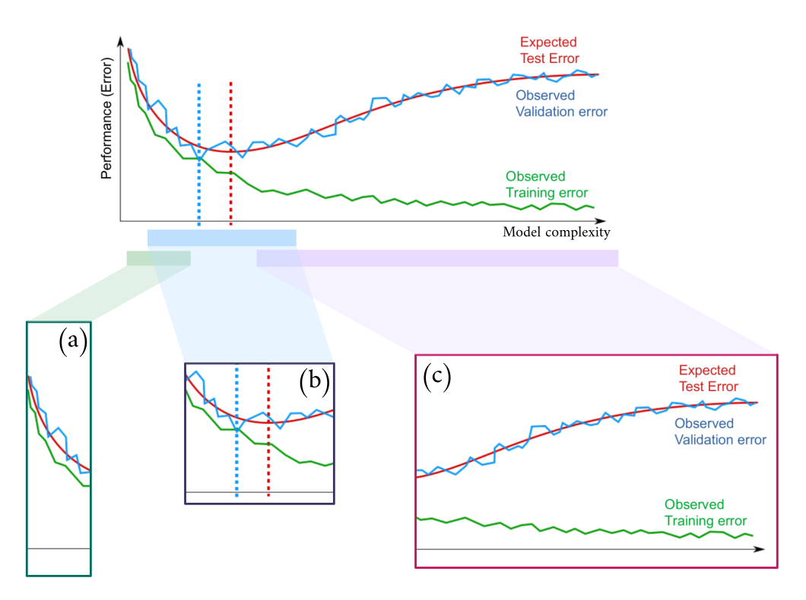
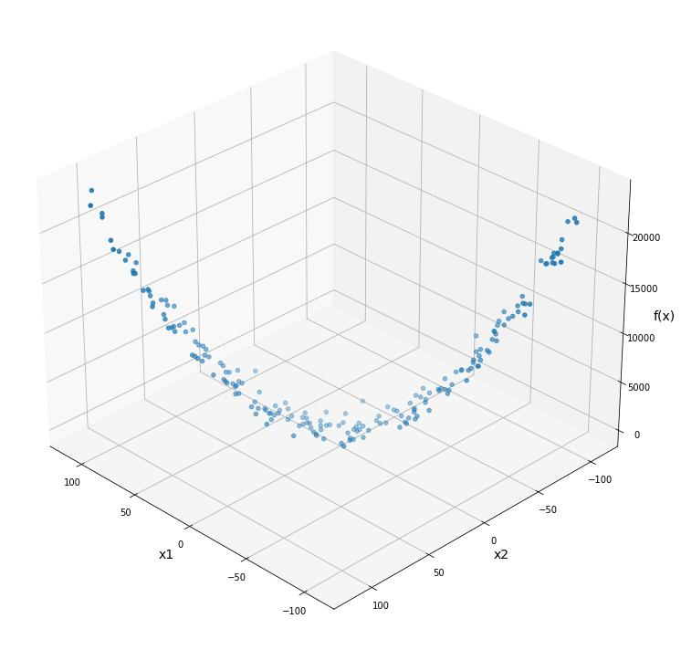

# Assignment 1

The assignment is split into two parts: you are asked to solve a regression problem and answer some questions.

You can use all the books, material, and help you need.
Remember that the questions you are asked are similar to those you may find in the final exam and are related to essential and fundamental machine learning concepts. As such, you will need to learn them sooner or later to pass the course.
We will give you some feedback afterwards.

## Tasks
You have to solve a regression problem. You are given a set of data consisting of input-output pairs `(x, y)`, where `x` is a bi-dimensional vector, and you have to build a model to fit this data.  We will then evaluate your model's performance on a **different test set**.

To complete the assignment, you must address the tasks below and submit your solution as a zip file on the iCorsi platform. More details are in the Instructions section below.

### T1. Linear Regression
Use the family of models `f(x, theta) = theta_0 + theta_1 * x_1 + theta_2 * x_2 + theta_3 * cos(x_1) + theta_4 * x_2 * x_2 + theta_5 * tanh(x_1) ` to fit the data (File: **data.npz**):
* Write in the report the formula of the model substituting parameters `theta_0, ..., theta_5` with the estimates you've found;
* Evaluate your model's test performance using the mean squared error as a performance measure.
* Implement Lasso Regression, what do you observe? What can you infer about the given family of models?

### T2. Non-Linear Regression
Consider any family of non-linear models of your choice to address the above regression problem (same data as T1):
* Evaluate the test performance of your model using the mean squared error as a performance measure;
* Compare your model with the linear regression of task 1. Which one is **statistically** better?

## Questions

Motivate all answers, but keep them short. Support the answers with appropriate formulas.

### Q1. Training versus Validation

Assume one of your classmates missed the lecture in which we presented the following figure.
Please explain it in your own words by using technical details and intuition, where appropriate. In particular,

1. What is the whole figure about?
2. Explain the behaviours of the curves in each of the three highlighted sections in the figure, namely (a), (b), and (c);
   1. Can you identify any signs of overfitting or underfitting in the plot? If yes, explain which sections correspond to which concept.
   2. How can you determine the optimal complexity of the model based on the given plot?
3. Is there any evidence of high approximation risk? Why? If yes, in which of the below subfigures?
4. Do you think that increasing the model complexity can bring the training error to zero? And the structural risk?
5. If the X axis represented the training iterations instead, would the training procedure that generated the figure use early stopping? Explain why. (**NB**: ignore the subfigures and the dashed vertical lines)

### Q2. Linear Regression

Consider the following regression problem in which the task is to estimate the target variable `y = g(x) + eta`, where `g(.)` is unknown, `eta ~ N(0, 1)`, and the input variable `x` is a bi-dimensional vector `x = [x_1, x_2]`.
Suppose to have `n` training samples and to fit the data using a linear model family `f(x, theta) = theta_0 + theta_1 * x_1 + theta_2 * x_2`.

Now, we add another regressor (feature) `x_3` (to obtain `f(x, theta) = theta_0 + theta_1 * x_1 + theta_2 * x_2 + theta_3 * x_3`), and we fit a linear model on the same data again. Comment and compare how the (a.) training error, (b.) test error, and (c.) coefficients would change in the following cases:

1. `x_3 = x_1 + 0.2 * x_2`.
2. `x_3 = x_1 ** 2` is the square of `x_1` (in Python `**` is the "power" operator, so ` 3 ** 2 = 3 * 3 = 9`).
3. `x_3` is a random variable independent from `y`.
4. How would your answers change if you were using Lasso Regression?
5. Explain the motivation behind Ridge and Lasso regression and their principal differences.

Motivate your answers.

**NB**: You **don't** have to run any experiment to answer this question. Your answers should be based only on your understanding of linear regression.

### Q3. Logistic Regression

##### 3.1

1. What are the main differences between the logistic-regression and the perceptron?
2. Discuss the major limit they share and how neural networks can solve it.
3. What is the role of activation functions in feedforward neural networks.

### Q4.
Consider the regression problem shown in the picture below and answer each point.

1. Do you think a model of the family f(x, theta) = theta_0 + theta_1 * x_1 + theta_2 * x_2 is a good choice for such task? Why?

2. Do you think using a feed forward neural network would improve the results?

